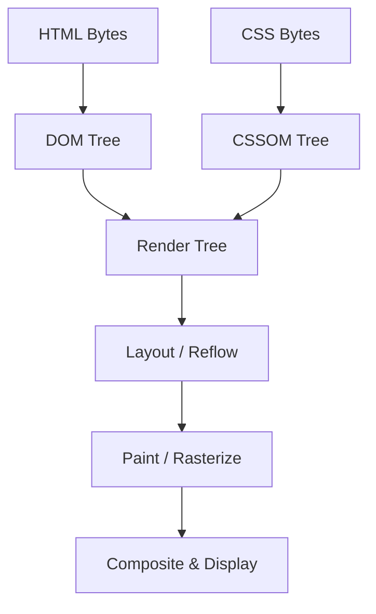

# 🌐 HTML - Advanced / Hard Questions

> **Topics Covered:** Canvas vs SVG, Critical Rendering Path (CRP), Web Workers API, Shadow DOM & Web Components, Cross-Site Scripting (XSS) Sanitization in HTML, Content Security Policy (CSP) Meta Tag, Server-Sent Events (`<event-source>`) & WebSockets in HTML.

---

### Q1: `<canvas>` vs `<svg>`
**Question:** Compare HTML5 `<canvas>` vs `<svg>` in terms of rendering model, performance, and best use cases.

**Answer:**
| Feature | `<canvas>` | `<svg>` |
| :--- | :--- | :--- |
| **Model** | Raster / Bitmap (Immediate Mode) | Vector / XML DOM Nodes (Retained Mode) |
| **DOM Tree** | Single `<canvas>` element in DOM | Every shape/path is an individual DOM element |
| **Scalability** | Pixels blur when zoomed in | Infinitely scalable without quality loss |
| **Event Handling**| Pixel-based manually calculated in JS | Supports native DOM event listeners (`onClick` on path) |
| **Performance** | High performance for thousands of animated objects (games, video filtering) | Degrades with thousands of complex DOM nodes |
| **Best For** | 2D/3D games (WebGL), real-time video manipulation, charts with millions of points | Logos, UI icons, interactive maps, responsive infographics |

---

### Q2: Critical Rendering Path (CRP) & HTML Parsing Optimization
**Question:** Explain the Critical Rendering Path from HTML byte stream to pixels on screen. How do you optimize it?

**Answer:**


1. **Conversion**: Bytes $
ightarrow$ Characters $
ightarrow$ Tokens $
ightarrow$ Nodes $
ightarrow$ **DOM Tree**.
2. **CSSOM Tree**: CSS styles are parsed into CSS Object Model.
3. **Render Tree**: Combines visible DOM nodes and computed CSSOM styles (omits `display: none` and `<head>`).
4. **Layout (Reflow)**: Calculates exact geometric coordinates and bounding boxes.
5. **Paint**: Fills pixels on layers (colors, borders, shadows, text).
6. **Composite**: GPU combines layers onto the screen.

**Optimization Strategies:**
- Minify HTML, CSS, JS payloads.
- Inline critical above-the-fold CSS.
- Defer non-critical JavaScript (`defer` / dynamic `import()`).
- Add `<link rel="preload">` and `<link rel="preconnect">` for key fonts & APIs.

---

### Q3: Shadow DOM & HTML Web Components
**Question:** What is Shadow DOM and how does it enable encapsulated Web Components?

**Answer:**
- **Shadow DOM** allows a hidden, isolated DOM tree to be attached to an element, scoping CSS styles and JavaScript so internal markup cannot leak out or be overwritten by global page styles.

```html
<user-card name="Utkarsh"></user-card>

<script>
class UserCard extends HTMLElement {
  constructor() {
    super();
    // Attach isolated shadow root
    const shadow = this.attachShadow({ mode: 'open' });
    const name = this.getAttribute('name') || 'Anonymous';
    
    shadow.innerHTML = `
      <style>
        .card { padding: 16px; border: 1px solid #ddd; border-radius: 8px; font-family: sans-serif; }
        h3 { color: #0066cc; margin: 0; }
      </style>
      <div class="card">
        <h3>User Profile</h3>
        <p>Name: ${name}</p>
      </div>
    `;
  }
}
customElements.define('user-card', UserCard);
</script>
```

---

### Q4: Content Security Policy (CSP) via HTML Meta Tags
**Question:** How does Content Security Policy protect against XSS attacks using HTML `<meta>` tags?

**Answer:**
- CSP restricts the sources from which scripts, styles, images, and fonts can be loaded and executed.
- Disallows execution of inline scripts (`eval`, inline `onclick`) unless whitelisted with nonces or hashes.

```html
<meta http-equiv="Content-Security-Policy" 
      content="default-src 'self'; script-src 'self' https://trustedscripts.com; style-src 'self' 'unsafe-inline';">
```
