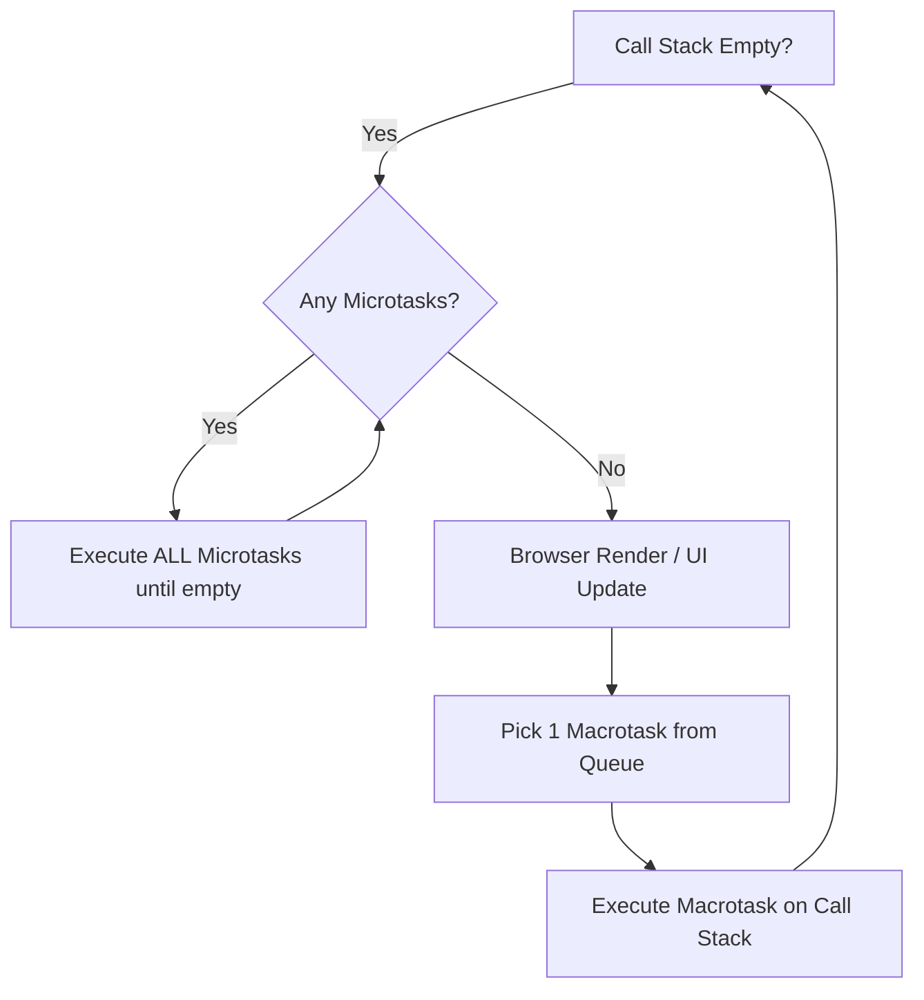

# 📜 JavaScript - Advanced / Hard Questions

> **Topics Covered:** JavaScript Event Loop & Microtask vs Macrotask Queue, Prototype & Prototypal Inheritance, `Object.create()` & Prototype Chain, Custom Polyfills (`map`, `filter`, `reduce`, `bind`, `Promise.all`), Memory Management & Garbage Collection (Mark-and-Sweep, Memory Leaks), Generators & Iterators (`function*`, `yield`), Web Workers & Multithreading, `Proxy` and `Reflect` APIs.

---

### Q1: The JavaScript Event Loop & Concurrency Model ⭐⭐⭐
**Question:** Explain how the JavaScript Event Loop works. What is the execution priority between Call Stack, Microtask Queue (`Promises`, `queueMicrotask`), and Macrotask Queue (`setTimeout`, `setInterval`, I/O)? Predict the output of this code.

**Answer:**
JavaScript is a single-threaded language with a non-blocking event-driven runtime.
1. **Call Stack**: Executes synchronous code line-by-line (LIFO).
2. **Microtask Queue**: High priority queue (Executed immediately after the current stack frame empties, before any macrotasks or browser rendering).
   - *Sources:* `Promise.then/catch/finally`, `queueMicrotask()`, `MutationObserver`.
3. **Macrotask / Task Queue**: Standard priority queue.
   - *Sources:* `setTimeout`, `setInterval`, `setImmediate` (Node), DOM events, network I/O.



#### Tricky Interview Output Puzzle:
```javascript
console.log("1");

setTimeout(() => {
  console.log("2");
}, 0);

Promise.resolve().then(() => {
  console.log("3");
}).then(() => {
  console.log("4");
});

queueMicrotask(() => {
  console.log("5");
});

console.log("6");

// Output:
// 1
// 6
// 3
// 5
// 4
// 2
```
*Explanation:* `1` and `6` are synchronous. Microtasks (`3`, `5`, then chained `4`) execute before the macrotask `setTimeout` (`2`).

---

### Q2: Prototypes & Prototypal Inheritance
**Question:** Explain how Prototypal Inheritance and the Prototype Chain work in JavaScript. How does `__proto__` relate to `.prototype`?

**Answer:**
- In JavaScript, every object has an internal link to another object called its **prototype** (`[[Prototype]]`, accessed via `Object.getPrototypeOf()` or `__proto__`).
- When accessing a property on an object, JavaScript searches the object itself; if not found, it traverses up the **Prototype Chain** until it reaches `Object.prototype` (whose prototype is `null`).
- `.prototype` is a property present on **Constructor Functions and Classes**, which becomes the `__proto__` of all instances created with `new`.

```javascript
function Animal(name) {
  this.name = name;
}
Animal.prototype.speak = function() {
  return `${this.name} makes a noise.`;
};

function Dog(name, breed) {
  Animal.call(this, name); // Super constructor
  this.breed = breed;
}
// Inherit prototype
Dog.prototype = Object.create(Animal.prototype);
Dog.prototype.constructor = Dog;

Dog.prototype.bark = function() {
  return `${this.name} barks!`;
};

const d = new Dog("Tommy", "Golden");
console.log(d.bark());  // "Tommy barks!"
console.log(d.speak()); // "Tommy makes a noise." (found on Animal.prototype)
```

---

### Q3: Custom Polyfills (`Promise.all`, `Array.prototype.myReduce`, `Function.prototype.myBind`)
**Question:** Write polyfills for `Promise.all` and `Array.prototype.reduce`.

**Answer:**

#### 1. `Promise.all` Polyfill:
```javascript
Promise.myAll = function(promises) {
  return new Promise((resolve, reject) => {
    if (!Array.isArray(promises)) {
      return reject(new TypeError("Argument must be an array"));
    }
    const results = [];
    let completedCount = 0;
    if (promises.length === 0) return resolve(results);

    promises.forEach((promise, index) => {
      Promise.resolve(promise)
        .then((value) => {
          results[index] = value;
          completedCount++;
          if (completedCount === promises.length) {
            resolve(results);
          }
        })
        .catch(reject); // First rejection rejects overall Promise
    });
  });
};
```

#### 2. `Array.prototype.reduce` Polyfill:
```javascript
Array.prototype.myReduce = function(callback, initialValue) {
  if (typeof callback !== "function") throw new TypeError("Callback must be a function");
  const arr = this;
  let accumulator = initialValue !== undefined ? initialValue : arr[0];
  let startIndex = initialValue !== undefined ? 0 : 1;

  for (let i = startIndex; i < arr.length; i++) {
    if (i in arr) {
      accumulator = callback(accumulator, arr[i], i, arr);
    }
  }
  return accumulator;
};
```

---

### Q4: JavaScript Memory Management & Garbage Collection
**Question:** How does the V8 Garbage Collector work (Mark-and-Sweep)? What are the common causes of Memory Leaks in JavaScript and how to prevent them?

**Answer:**
- **Garbage Collection Algorithm (Mark-and-Sweep)**:
  1. GC starts from **Roots** (`window`, global variables, active call stack frames).
  2. Traverses and "marks" all objects reachable from roots.
  3. Sweeps and deallocates memory for any un-marked (unreachable) objects in the heap.
- **Common Memory Leaks:**
  1. **Accidental Global Variables**: `foo = "bar"` without `let/const`.
  2. **Forgotten Timers / Intervals**: `setInterval` running in background referencing unmounted DOM components.
  3. **Detached DOM Elements**: Holding references to DOM nodes removed from document.
  4. **Uncleaned Closures**: Closures holding massive arrays or cache objects indefinitely.

---

### Q5: JavaScript `Proxy` and `Reflect` APIs
**Question:** What is a `Proxy` in JavaScript? How is it used for reactive state systems (e.g., Vue 3)?

**Answer:**
- A **`Proxy`** object wraps another target object and intercepts fundamental operations like property reading (`get`), property writing (`set`), and deletion (`deleteProperty`).

```javascript
const state = { count: 0 };

const reactiveState = new Proxy(state, {
  get(target, prop, receiver) {
    console.log(`[Read] Accessing property: ${String(prop)}`);
    return Reflect.get(target, prop, receiver);
  },
  set(target, prop, value, receiver) {
    console.log(`[Write] Updating ${String(prop)} from ${target[prop]} to ${value}`);
    const success = Reflect.set(target, prop, value, receiver);
    // Trigger UI re-render here
    return success;
  }
});

reactiveState.count = 1; // Logs write
console.log(reactiveState.count); // Logs read, returns 1
```
