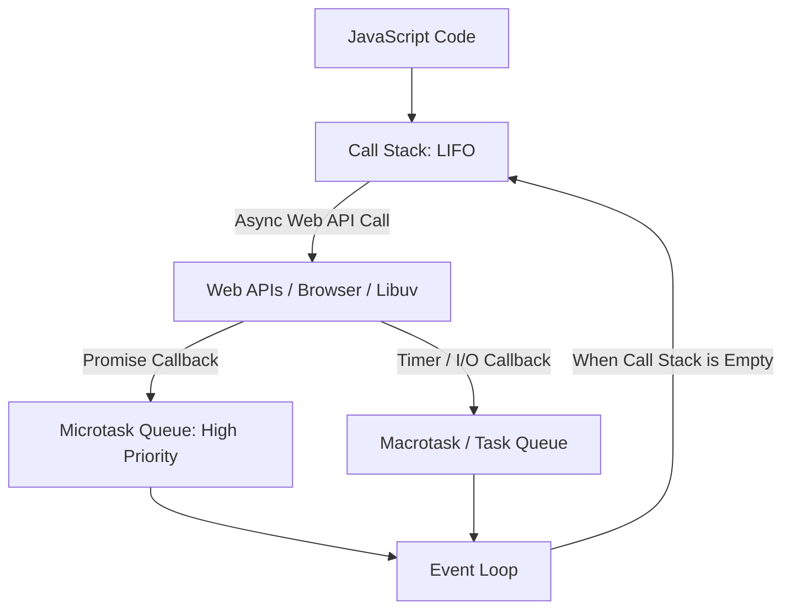

# 📜 Comprehensive JavaScript Interview Questions & Answers Master Guide

> **A curated, interview-tested question bank covering all 24 essential JavaScript topics with clear answers, code examples, outputs, diagrams, and comparison tables.**

---

## 📑 Table of Contents

1. [Promises](#1-promises)
2. [Promise Static Methods](#2-promise-static-methods)
3. [Async / Await](#3-async--await)
4. [DOM (Document Object Model)](#4-dom-document-object-model)
5. [Scope](#5-scope)
6. [Scope Chain](#6-scope-chain)
7. [Callbacks & Callback Hell](#7-callbacks--callback-hell)
8. [Event Loop & Concurrency](#8-event-loop--concurrency)
9. [Event Propagation](#9-event-propagation)
10. [Event Bubbling](#10-event-bubbling)
11. [Event Capturing](#11-event-capturing)
12. [Event Delegation](#12-event-delegation)
13. [preventDefault() vs stopPropagation()](#13-preventdefault-vs-stoppropagation)
14. [ES6+ Core Features](#14-es6-core-features)
15. [ReferenceError, TypeError & SyntaxError](#15-referenceerror-typeerror--syntaxerror)
16. [Array reduce() & Higher-Order Array Iterators](#16-array-reduce--higher-order-array-iterators)
17. [Spread Operator](#17-spread-operator)
18. [Rest Parameter](#18-rest-parameter)
19. [Spread vs Rest Comparison](#19-spread-vs-rest-comparison)
20. [Destructuring (Array & Object)](#20-destructuring-array--object)
21. [Pure Functions & Side Effects](#21-pure-functions--side-effects)
22. [Higher-Order Functions](#22-higher-order-functions)
23. [Function Currying & Partial Application](#23-function-currying--partial-application)
24. [Important Related JavaScript Questions](#24-important-related-javascript-questions)

---

# 1. PROMISES

## 1.1 What is a Promise?

### Answer
A **Promise** is an object representing the eventual completion (or failure) of an asynchronous operation and its resulting value. It allows you to associate handlers with an asynchronous action's eventual success value or failure reason.

### Example
```js
const promise = new Promise((resolve, reject) => {
    const success = true;
    if (success) {
        resolve("Operation Successful!");
    } else {
        reject("Operation Failed!");
    }
});

promise
    .then(result => console.log(result))
    .catch(error => console.error(error));
```

### Output
```
Operation Successful!
```

---

## 1.2 Why are Promises used?

### Answer
Promises are used to handle asynchronous operations cleanly without falling into **Callback Hell** (deeply nested callbacks). They provide:
1. Better readability and structured control flow.
2. Built-in centralized error handling with `.catch()`.
3. Powerful composition via Promise chaining and parallel combinators.

---

## 1.3 What are the 3 states of a Promise?

### Answer
A Promise is always in one of three mutually exclusive states:
1. **Pending**: Initial state; the asynchronous operation is still in progress.
2. **Fulfilled (Resolved)**: The operation completed successfully (`resolve(value)` was called).
3. **Rejected**: The operation failed (`reject(error)` was called).

Once a promise is fulfilled or rejected, it is considered **settled** (or resolved) and its state can never change again.

```
          +-------------+
          |   Pending   |
          +-------------+
             /         \
  resolve() /           \ reject()
           v             v
    +-----------+   +----------+
    | Fulfilled |   | Rejected |
    +-----------+   +----------+
```

---

## 1.4 How to create a Promise and difference between resolve() and reject()?

### Answer
A Promise is created using the `new Promise()` constructor, which takes an executor callback with two arguments: `resolve` and `reject`.
- **`resolve(value)`**: Transitions the promise from `pending` to `fulfilled` and passes the resulting value to `.then()` handlers.
- **`reject(reason)`**: Transitions the promise from `pending` to `rejected` and passes the error reason to `.catch()` handlers.

### Example
```js
function checkEvenNumber(num) {
    return new Promise((resolve, reject) => {
        if (num % 2 === 0) {
            resolve(`${num} is even!`);
        } else {
            reject(new Error(`${num} is odd!`));
        }
    });
}

checkEvenNumber(4)
    .then(res => console.log("Success:", res))
    .catch(err => console.log("Error:", err.message));
```

### Output
```
Success: 4 is even!
```

---

## 1.5 How do then(), catch(), and finally() work?

### Answer
- **`.then(onFulfilled, onRejected)`**: Attaches callbacks for the resolution and/or rejection of the Promise. Always returns a new Promise.
- **`.catch(onRejected)`**: Specifically handles errors and rejections in the promise chain.
- **`.finally(onFinally)`**: Executes a cleanup callback when the promise is settled (whether fulfilled or rejected). Does not receive any arguments.

### Example
```js
function fetchUser(id) {
    return new Promise((resolve, reject) => {
        if (id > 0) resolve({ id, name: "Utkarsh" });
        else reject("Invalid User ID");
    });
}

fetchUser(1)
    .then(user => {
        console.log("User found:", user.name);
        return user.id;
    })
    .catch(err => console.error("Error:", err))
    .finally(() => console.log("Fetch operation finished."));
```

### Output
```
User found: Utkarsh
Fetch operation finished.
```

---

## 1.6 What is Promise Chaining?

### Answer
**Promise Chaining** is a pattern where multiple asynchronous operations are executed in sequence. Each `.then()` handler returns a value or another Promise, which becomes the input for the next `.then()` in the chain.

### Example
```js
function stepOne() {
    return Promise.resolve(10);
}

stepOne()
    .then(num => {
        console.log("Step 1:", num);
        return num * 2;
    })
    .then(num => {
        console.log("Step 2:", num);
        return num + 5;
    })
    .then(num => {
        console.log("Step 3 (Final):", num);
    });
```

### Output
```
Step 1: 10
Step 2: 20
Step 3 (Final): 25
```

---

## 1.7 What is Promise Nesting and why should you avoid it?

### Answer
**Promise Nesting** occurs when `.then()` handlers are nested inside one another rather than chained. This re-creates the pyramid-of-doom problem (anti-pattern) and should be refactored into flat chaining or `async/await`.

```js
// ❌ Anti-pattern: Nested Promises
getUser().then(user => {
    getOrders(user.id).then(orders => {
        getPayment(orders[0].id).then(payment => {
            console.log(payment);
        });
    });
});

// ✅ Best Practice: Flat Promise Chaining
getUser()
    .then(user => getOrders(user.id))
    .then(orders => getPayment(orders[0].id))
    .then(payment => console.log(payment))
    .catch(err => console.error(err));
```

---

## 1.8 Promise vs Callback vs async/await

### Answer
| Feature | Callback | Promise | async / await |
| :--- | :--- | :--- | :--- |
| **Syntax** | Functions passed into functions | `.then()`, `.catch()`, `.finally()` | Synchronous-looking `await promise` |
| **Readability** | Poor with nesting (Callback Hell) | Good (Flat linear chain) | Excellent (Clean and intuitive) |
| **Error Handling**| Manual per callback (`if (err)`) | Centralized with `.catch()` | Standard `try / catch` blocks |
| **Composition** | Difficult | Built-in (`Promise.all`, `race`) | Native loops (`for...of`) and `Promise.all` |

---

# 2. PROMISE STATIC METHODS

## 2.1 What is Promise.all() and what happens when one rejects?

### Answer
- **`Promise.all(iterable)`**: Takes an array of promises and runs them in parallel.
- **Resolves**: When **ALL** input promises have resolved, returning an array of resolved values in the original order.
- **Rejects**: **Immediately** when **ANY single** promise rejects (Fail-Fast behavior), discarding all other resolved values.

### Example
```js
const p1 = Promise.resolve("Data A");
const p2 = new Promise((resolve) => setTimeout(() => resolve("Data B"), 100));
const p3 = Promise.resolve("Data C");

Promise.all([p1, p2, p3])
    .then(results => console.log("All resolved:", results))
    .catch(err => console.error("Failed:", err));
```

### Output
```
All resolved: [ 'Data A', 'Data B', 'Data C' ]
```

---

## 2.2 What is Promise.allSettled()?

### Answer
- **`Promise.allSettled(iterable)`**: Runs all promises in parallel and waits until **every promise has settled** (either fulfilled or rejected).
- **Never rejects**: Returns an array of outcome objects with `{ status: 'fulfilled', value }` or `{ status: 'rejected', reason }`.
- **Use Case**: When tasks are independent (e.g. sending bulk emails where some failing shouldn't block the rest).

### Example
```js
const p1 = Promise.resolve("Success 1");
const p2 = Promise.reject("Network Error");
const p3 = Promise.resolve("Success 2");

Promise.allSettled([p1, p2, p3])
    .then(results => console.log(results));
```

### Output
```js
[
  { status: 'fulfilled', value: 'Success 1' },
  { status: 'rejected', reason: 'Network Error' },
  { status: 'fulfilled', value: 'Success 2' }
]
```

---

## 2.3 What is Promise.race()?

### Answer
- **`Promise.race(iterable)`**: Returns a promise that settles as soon as the **first promise settles** (whether it resolves OR rejects).
- **Use Case**: Implementing network timeouts (racing an API fetch against a 5-second timeout promise).

### Example
```js
const fast = new Promise(resolve => setTimeout(() => resolve("Fast result"), 50));
const slow = new Promise(resolve => setTimeout(() => resolve("Slow result"), 200));

Promise.race([fast, slow])
    .then(result => console.log("Winner:", result));
```

### Output
```
Winner: Fast result
```

---

## 2.4 What is Promise.any()?

### Answer
- **`Promise.any(iterable)`**: Waits for the **first promise to fulfill (resolve)** successfully.
- If a promise rejects, it is ignored and it waits for the next.
- If **ALL** promises reject, it rejects with an `AggregateError` grouping all rejection reasons.
- **Use Case**: Querying multiple mirror servers / CDN endpoints and taking the fastest successful response.

### Example
```js
const pErr1 = Promise.reject("Mirror 1 down");
const pFast = new Promise(resolve => setTimeout(() => resolve("Mirror 2 OK"), 100));
const pSlow = new Promise(resolve => setTimeout(() => resolve("Mirror 3 OK"), 300));

Promise.any([pErr1, pFast, pSlow])
    .then(res => console.log("First Successful:", res))
    .catch(err => console.error("All failed:", err.errors));
```

### Output
```
First Successful: Mirror 2 OK
```

---

## 2.5 What are Promise.resolve() and Promise.reject()?

### Answer
- **`Promise.resolve(value)`**: Returns a Promise object that is resolved with given value. If the value is a promise, it returns it directly.
- **`Promise.reject(reason)`**: Returns a Promise object that is rejected with given reason.

### Example
```js
const cachedData = Promise.resolve({ cached: true, timestamp: Date.now() });
cachedData.then(data => console.log(data.cached)); // true

const errorPromise = Promise.reject(new Error("Unauthorized"));
errorPromise.catch(err => console.log(err.message)); // Unauthorized
```

---

## 2.6 Difference between Promise.all, Promise.allSettled, Promise.race, and Promise.any

### Answer
| Method | Resolves When | Rejects When | Return Value on Success |
| :--- | :--- | :--- | :--- |
| **`Promise.all`** | **ALL** promises resolve | **ANY** promise rejects (Fail-Fast) | Array of all resolved values `[v1, v2]` |
| **`Promise.allSettled`**| **ALL** promises settle (Never rejects) | Never rejects | Array of status objects `[{status, value/reason}]` |
| **`Promise.race`** | **FIRST** promise settles (resolve/reject) | **FIRST** promise rejects | Value/Reason of the fastest settled promise |
| **`Promise.any`** | **FIRST** promise **fulfills** | **ALL** promises reject | Value of the fastest fulfilled promise (or `AggregateError`) |

---

# 3. ASYNC / AWAIT

## 3.1 What is async/await and how does it work?

### Answer
- **`async`**: Placed before a function declaration to declare an asynchronous function. **An `async` function always returns a Promise** (non-promise return values are automatically wrapped in `Promise.resolve()`).
- **`await`**: Pauses the execution of the surrounding `async` function until the awaited Promise settles, then returns the resolved value. It can only be used inside `async` functions or at the top level of ES modules.

### Example
```js
async function fetchUser() {
    return { name: "Utkarsh", role: "Dev" };
}

async function run() {
    const user = await fetchUser();
    console.log("Fetched User:", user.name);
}

run();
```

### Output
```
Fetched User: Utkarsh
```

---

## 3.2 How to handle errors with async/await (try/catch)?

### Answer
Errors in `async/await` are caught using standard synchronous-looking `try...catch` blocks. If an awaited promise rejects, it throws an exception that is caught by the `catch` block.

### Example
```js
async function loadData(url) {
    try {
        if (!url) throw new Error("URL is required");
        const response = await fetch(url);
        const data = await response.json();
        return data;
    } catch (error) {
        console.error("Caught in try/catch:", error.message);
    } finally {
        console.log("Load attempt completed.");
    }
}

loadData("");
```

### Output
```
Caught in try/catch: URL is required
Load attempt completed.
```

---

## 3.3 Sequential vs Parallel Execution with async/await

### Answer
- **Sequential**: Using `await` one after another in a loop or lines. Each operation waits for the previous one to complete (Takes $T_1 + T_2 + T_3$).
- **Parallel (Concurrent)**: Firing all promises simultaneously and awaiting `Promise.all()` (Takes $\max(T_1, T_2, T_3)$).

### Example
```js
const delay = (ms, val) => new Promise(res => setTimeout(() => res(val), ms));

// Sequential (Slow: 100ms + 100ms = 200ms)
async function sequential() {
    console.time("Seq");
    const a = await delay(100, "A");
    const b = await delay(100, "B");
    console.timeEnd("Seq");
}

// Parallel (Fast: max(100ms, 100ms) = 100ms)
async function parallel() {
    console.time("Parallel");
    const [a, b] = await Promise.all([delay(100, "A"), delay(100, "B")]);
    console.timeEnd("Parallel");
}

sequential().then(parallel);
```

---

## 3.4 What are Common Mistakes with async/await?

### Answer
1. **Forgetting `await`**: Returns the pending Promise object instead of the resolved data.
2. **Sequential bottlenecks inside loops**: Writing `for (const item of items) { await fetch(item); }` when tasks are independent (use `Promise.all(items.map(...))` instead).
3. **Missing `try/catch`**: Causes unhandled promise rejections.
4. **Using `await` inside `forEach`**: `Array.prototype.forEach` is not async-aware; it will fire all callbacks without awaiting them.

---

# 4. DOM (DOCUMENT OBJECT MODEL)

## 4.1 What is the DOM?

### Answer
The **DOM (Document Object Model)** is a tree-like object representation of the HTML document created by the browser. It provides a programming interface allowing JavaScript to access, modify, delete, and add elements, attributes, and styles dynamically.

---

## 4.2 DOM Selectors: getElementById, getElementsByClassName, getElementsByTagName, querySelector, querySelectorAll

### Answer
| Method | Returns | Return Type | Live vs Static | Accepts |
| :--- | :--- | :--- | :--- | :--- |
| **`getElementById('id')`** | Single Element | `HTMLElement` or `null` | N/A | ID string |
| **`getElementsByClassName('class')`** | Multiple Elements | `HTMLCollection` | **Live** | Class name |
| **`getElementsByTagName('tag')`** | Multiple Elements | `HTMLCollection` | **Live** | Tag name (`p`, `div`) |
| **`querySelector('selector')`** | First Match | `HTMLElement` or `null` | N/A | Any CSS Selector (`.card > p`) |
| **`querySelectorAll('selector')`**| All Matches | `NodeList` | **Static** | Any CSS Selector |

### Example
```js
// Select by ID
const header = document.getElementById("main-header");

// Select by class (HTMLCollection)
const cards = document.getElementsByClassName("card");

// Select first match using CSS selector
const activeBtn = document.querySelector(".btn.active");

// Select all matching nodes (NodeList - supports forEach)
const allButtons = document.querySelectorAll("button");
allButtons.forEach(btn => console.log(btn.textContent));
```

---

## 4.3 HTMLCollection vs NodeList

### Answer
- **`HTMLCollection`**:
  - A collection of **HTML Elements only**.
  - **Live**: Updates automatically when the DOM changes.
  - Does NOT have native array methods like `.forEach()` (must convert via `Array.from()`).
- **`NodeList`**:
  - A collection of **DOM Nodes** (can include text nodes, comments, and elements).
  - Usually **Static** (from `querySelectorAll`), though `element.childNodes` is live.
  - Supports native `.forEach()`.

---

# 5. SCOPE

## 5.1 What is Scope? Global, Function, and Block Scope

### Answer
**Scope** is the current context of execution in which values and expressions are visible and can be referenced.

1. **Global Scope**: Variables declared outside any function or block are accessible anywhere in the program.
2. **Function Scope (`var`)**: Variables declared inside a function are accessible only within that function.
3. **Block Scope (`let`, `const`)**: Variables declared inside a block `{ ... }` are accessible only inside that block.

### Example
```js
var globalVar = "Global";

function scopeTest() {
    var funcVar = "Function Scope";

    if (true) {
        let blockVar = "Block Scope";
        const alsoBlock = "Const Block";
        var leakedVar = "Var leaks out of block";
        console.log(blockVar); // "Block Scope"
    }

    console.log(leakedVar); // "Var leaks out of block"
    // console.log(blockVar); // ReferenceError: blockVar is not defined
}

scopeTest();
```

---

## 5.2 Difference between var, let, and const in terms of Scope

### Answer
| Feature | `var` | `let` | `const` |
| :--- | :--- | :--- | :--- |
| **Scope** | Function Scope | Block Scope | Block Scope |
| **Block `{}` Enclosure** | Leaks outside `if`/`for` blocks | Confined to `{}` block | Confined to `{}` block |
| **Re-declaration** | Allowed in same scope | Throws `SyntaxError` | Throws `SyntaxError` |
| **Re-assignment** | Allowed | Allowed | Throws `TypeError` |

---

# 6. SCOPE CHAIN

## 6.1 What is the Scope Chain and How does JavaScript find a variable?

### Answer
The **Scope Chain** is the hierarchical lookup mechanism JavaScript uses to resolve variable values.
- When a variable is accessed, the JS engine first inspects the **Current Local Scope**.
- If not found, it traverses upward to the **Outer Lexical Scope**.
- It continues searching upward until it reaches the **Global Scope**.
- If the variable is not found in the global scope, JavaScript throws a **`ReferenceError`**.

```
+--------------------------+
|       Global Scope       |  <- (Last lookup step)
|   +------------------+   |
|   |   Outer Scope    |   |  <- (Searched next)
|   |   +----------+   |   |
|   |   | Current  |   |   |  <- (Searched first)
|   |   +----------+   |   |
|   +------------------+   |
+--------------------------+
```

### Example
```js
const globalX = "Global";

function outer() {
    const outerY = "Outer";

    function inner() {
        const innerZ = "Inner";
        console.log(innerZ);   // Found in current scope
        console.log(outerY);   // Found in outer scope via Scope Chain
        console.log(globalX);  // Found in global scope via Scope Chain
    }

    inner();
}

outer();
```

---

## 6.2 How does the Scope Chain relate to Closures?

### Answer
A **Closure** is created when an inner function retains access to its parent function's lexical scope chain even after the parent function has finished executing and has been removed from the Call Stack.

---

# 7. CALLBACKS & CALLBACK HELL

## 7.1 What is a Callback Function? Synchronous vs Asynchronous

### Answer
A **Callback Function** is a function passed into another function as an argument, which is then invoked inside the outer function to complete an action.
- **Synchronous Callback**: Executed immediately during the execution of the higher-order function (e.g., `[1, 2].map(x => x * 2)`).
- **Asynchronous Callback**: Executed at a later time after an asynchronous operation or timer finishes (e.g., `setTimeout`, event listeners).

### Example
```js
// Synchronous
function processData(callback) {
    console.log("Processing...");
    callback("Done");
}
processData(status => console.log("Status:", status));

// Asynchronous
console.log("Start");
setTimeout(() => {
    console.log("Async Callback executed after 100ms");
}, 100);
console.log("End");
```

### Output
```
Processing...
Status: Done
Start
End
Async Callback executed after 100ms
```

---

## 7.2 What is Callback Hell and how can it be avoided?

### Answer
**Callback Hell (Pyramid of Doom)** is a situation where multiple asynchronous callbacks are nested deeply within each other, creating triangular unreadable code that is difficult to debug and maintain.

### Example & Solutions
```js
// ❌ Callback Hell
getUser(userId, function(user) {
    getOrders(user.id, function(orders) {
        getOrderDetails(orders[0].id, function(details) {
            getPayment(details.paymentId, function(payment) {
                console.log(payment);
            });
        });
    });
});

// ✅ Solution 1: Refactor with Promises
getUser(userId)
    .then(user => getOrders(user.id))
    .then(orders => getOrderDetails(orders[0].id))
    .then(details => getPayment(details.paymentId))
    .then(payment => console.log(payment))
    .catch(err => console.error(err));

// ✅ Solution 2: Refactor with async/await (Cleanest)
async function showPayment(userId) {
    try {
        const user = await getUser(userId);
        const orders = await getOrders(user.id);
        const details = await getOrderDetails(orders[0].id);
        const payment = await getPayment(details.paymentId);
        console.log(payment);
    } catch (err) {
        console.error(err);
    }
}
```

---

# 8. EVENT LOOP & CONCURRENCY

## 8.1 What is the Event Loop and Why is it Needed?

### Answer
JavaScript is a **single-threaded** language with a single **Call Stack**, meaning it can only execute one piece of code at a time. The **Event Loop** is the concurrency mechanism that coordinates asynchronous non-blocking operations by monitoring the Call Stack and task queues, pushing pending callbacks to the Call Stack when it becomes empty.



---

## 8.2 Microtask Queue vs Macrotask (Task) Queue

### Answer
| Feature | Microtask Queue | Macrotask (Task) Queue |
| :--- | :--- | :--- |
| **Sources** | `Promise.then/catch/finally`, `queueMicrotask()`, `MutationObserver` | `setTimeout()`, `setInterval()`, `setImmediate()` (Node), DOM events, I/O |
| **Priority** | **High Priority** (Executed immediately after call stack empties) | Standard Priority (Executed one-by-one) |
| **Execution Rule**| **ALL** microtasks are drained before the next macrotask is processed | Exactly **one** macrotask is processed per loop tick before checking microtasks |

---

## 8.3 Output Puzzle: Promise vs setTimeout Execution Order

### Question: What is the output of the following code and why?
```js
console.log("A");

setTimeout(() => {
    console.log("B");
}, 0);

Promise.resolve().then(() => {
    console.log("C");
});

console.log("D");
```

### Answer & Output
```
A
D
C
B
```

### Step-by-Step Explanation:
1. `console.log("A")` runs synchronously $
ightarrow$ Prints **A**.
2. `setTimeout` registers a timer in Web APIs; after 0ms, its callback is placed into the **Macrotask Queue**.
3. `Promise.resolve().then(...)` registers its callback in the **Microtask Queue**.
4. `console.log("D")` runs synchronously $
ightarrow$ Prints **D**.
5. Call Stack is now empty. The Event Loop checks the **Microtask Queue** first $
ightarrow$ executes `console.log("C")` $
ightarrow$ Prints **C**.
6. Microtask queue is empty. The Event Loop picks the next task from the **Macrotask Queue** $
ightarrow$ executes `console.log("B")` $
ightarrow$ Prints **B**.

---

# 9. EVENT PROPAGATION

## 9.1 What is Event Propagation? (Capturing, Target, Bubbling)

### Answer
**Event Propagation** describes the lifecycle and path that an event takes through the DOM tree from the `window` to the target element and back.

#### The 3 Phases of Event Propagation:
1. **Capturing Phase (Trickling)**: The event travels down from `window` $
ightarrow$ `document` $
ightarrow$ `<html>` $
ightarrow$ parent elements toward the target element.
2. **Target Phase**: The event reaches the actual target element that triggered the interaction.
3. **Bubbling Phase**: The event bubbles up from the target element back through ancestor elements to `window`.

```
              | |  Capturing Phase
   Window     | |  (Phase 1: Downward)
     v        | |
   Parent     | |       ^  Bubbling Phase
     v        | |       |  (Phase 3: Upward)
   Target  <--[ Target Phase (Phase 2) ]
```

---

# 10. EVENT BUBBLING

## 10.1 What is Event Bubbling and how to stop it using `stopPropagation()`?

### Answer
**Event Bubbling** is the phase where an event triggers handlers on the target element and then bubbles up the DOM tree, firing the same event handlers on all parent ancestor containers.

### Example
```html
<div id="parent" style="padding: 20px; background: lightblue;">
    <button id="child">Click Me</button>
</div>

<script>
document.getElementById("parent").addEventListener("click", () => {
    console.log("Parent Clicked");
});

document.getElementById("child").addEventListener("click", (event) => {
    console.log("Child Clicked");
    // event.stopPropagation(); // Uncomment to stop bubbling to parent!
});
</script>
```

### Output (When child button is clicked):
```
Child Clicked
Parent Clicked
```
*(If `event.stopPropagation()` is called inside the child listener, only `"Child Clicked"` prints).*

---

# 11. EVENT CAPTURING

## 11.1 What is Event Capturing and how to enable it?

### Answer
**Event Capturing (Trickling)** is the opposite of bubbling. Handlers registered in the capturing phase execute *before* the event reaches the target element.
- To enable capturing, pass `{ capture: true }` or `true` as the third argument to `addEventListener`.

### Example
```js
parent.addEventListener("click", () => {
    console.log("Parent (Capturing Phase)");
}, true); // true enables Capturing

child.addEventListener("click", () => {
    console.log("Child (Target)");
});
```

### Output (When child is clicked):
```
Parent (Capturing Phase)
Child (Target)
```

---

# 12. EVENT DELEGATION

## 12.1 What is Event Delegation and why is it useful?

### Answer
**Event Delegation** is a technique where you attach a single event listener to a common **parent element** instead of attaching individual listeners to hundreds of child elements. It leverages **Event Bubbling** to intercept clicks on children via `event.target`.

### Advantages:
1. **Memory Efficiency**: 1 event listener in memory instead of 1,000.
2. **Dynamic Elements**: Automatically works for newly added DOM elements without re-attaching listeners.

### Example
```html
<ul id="todo-list">
    <li data-id="1">Buy Milk</li>
    <li data-id="2">Learn JavaScript</li>
    <li data-id="3">Build Project</li>
</ul>

<script>
const list = document.getElementById("todo-list");

list.addEventListener("click", (event) => {
    if (event.target && event.target.tagName === "LI") {
        console.log("Clicked Task ID:", event.target.dataset.id);
        console.log("Text:", event.target.textContent);
    }
});
</script>
```

---

# 13. PREVENTDEFAULT() VS STOPPROPAGATION()

## 13.1 What is preventDefault() and how does it differ from stopPropagation()?

### Answer
- **`event.preventDefault()`**: Prevents the **default browser behavior** for the event (e.g. stops `<form>` submission from refreshing the page, stops `<a>` link navigation, prevents checkbox toggling). Does NOT stop event bubbling.
- **`event.stopPropagation()`**: Prevents the event from traveling up or down the DOM tree (stops bubbling/capturing). Does NOT prevent the default browser behavior.

### Example
```js
// Prevent form submit page refresh
document.querySelector("form").addEventListener("submit", (event) => {
    event.preventDefault();
    console.log("Form submitted via AJAX without page reload.");
});

// Prevent link navigation
document.querySelector("a").addEventListener("click", (event) => {
    event.preventDefault();
    console.log("Link click intercepted!");
});
```

---

# 14. ES6+ CORE FEATURES

## 14.1 What are the most important ES6 (ECMAScript 2015) features?

### Answer
1. **`let` and `const`**: Block-scoped variable declarations.
2. **Arrow Functions (`() => {}`)**: Lexical `this` binding and concise syntax.
3. **Template Literals**: String interpolation with backticks (`` `Hello ${name}` ``).
4. **Destructuring**: Convenient extraction from Arrays and Objects.
5. **Spread (`...`) & Rest (`...`) Operators**: Unpacking and packing iterables.
6. **Default Parameters**: Default values for function arguments (`function(a = 1)`).
7. **Classes & Inheritance**: Syntactic sugar over prototype-based inheritance (`class`, `extends`, `super`).
8. **Modules**: Standardized `import` and `export`.
9. **Promises**: Native asynchronous handling.
10. **Map and Set**: Key-value collections (supporting any key type) and unique value sets.
11. **`for...of` Loop**: Iterating over iterable objects (Arrays, Maps, Sets, Strings).
12. **Symbol**: Unique primitive type used for private object properties.

---

# 15. REFERENCEERROR, TYPEERROR & SYNTAXERROR

## 15.1 What is ReferenceError, TypeError, and SyntaxError?

### Answer
| Error Type | Meaning | Common Causes |
| :--- | :--- | :--- |
| **`ReferenceError`** | Attempting to access an identifier that does not exist in scope | Accessing undeclared variable (`x`), or accessing `let`/`const` inside TDZ |
| **`TypeError`** | An operation was performed on an incompatible data type | Calling a non-function (`num()`), modifying `const`, accessing property on `null`/`undefined` (`undefined.foo`) |
| **`SyntaxError`** | Invalid JavaScript grammar/syntax | Missing closing bracket `}`, duplicate `let` declaration in same scope |

### Example
```js
// 1. ReferenceError
// console.log(unknownVar); // ReferenceError: unknownVar is not defined

// 2. TypeError
const num = 42;
// num = 50; // TypeError: Assignment to constant variable
// null.toString(); // TypeError: Cannot read properties of null

// 3. SyntaxError
// let a = 1; let a = 2; // SyntaxError: Identifier 'a' has already been declared
```

---

# 16. ARRAY REDUCE() & HIGHER-ORDER ARRAY ITERATORS

## 16.1 How does Array.prototype.reduce() work?

### Answer
`reduce(callback, initialValue)` executes a reducer function on each element of the array, resulting in a **single accumulated output value**.

### Reducer Parameters:
- **`accumulator (acc)`**: Stores the accumulated result from previous iterations.
- **`currentValue (curr)`**: The current array element being processed.
- **`initialValue`**: Starting value for the accumulator.

### Example 1: Sum & Maximum
```js
const numbers = [10, 5, 25, 8];

// Sum
const sum = numbers.reduce((acc, curr) => acc + curr, 0); // 48

// Maximum
const max = numbers.reduce((acc, curr) => Math.max(acc, curr), -Infinity); // 25
```

### Example 2: Count Occurrences (Frequency Map)
```js
const fruits = ["apple", "banana", "apple", "orange", "banana", "apple"];

const count = fruits.reduce((acc, fruit) => {
    acc[fruit] = (acc[fruit] || 0) + 1;
    return acc;
}, {});
console.log(count); // { apple: 3, banana: 2, orange: 1 }
```

---

## 16.2 Comparison: map() vs filter() vs forEach() vs reduce()

### Answer
| Method | Purpose | Returns | Mutates Original Array? |
| :--- | :--- | :--- | :--- |
| **`map()`** | Transforms every element | **New Array** of equal length | ❌ No |
| **`filter()`** | Selects elements matching a condition | **New Array** of matching elements | ❌ No |
| **`forEach()`** | Executes side-effects for each element | **`undefined`** | ❌ No |
| **`reduce()`** | Condenses array into a single value | **Single Value** (Number, Object, Array) | ❌ No |

---

# 17. SPREAD OPERATOR

## 17.1 What is the Spread Operator and How is it Used?

### Answer
The **Spread Operator (`...`)** unpacks / expands elements of an array, object, or string into individual elements.

```js
// 1. Array Cloning & Merging
const arr1 = [1, 2];
const arr2 = [3, 4];
const combined = [...arr1, ...arr2, 5]; // [1, 2, 3, 4, 5]

// 2. Object Cloning & Merging
const user = { name: "Utkarsh", role: "Developer" };
const updatedUser = { ...user, city: "Delhi", role: "Lead Developer" };
console.log(updatedUser); // { name: 'Utkarsh', role: 'Lead Developer', city: 'Delhi' }

// 3. Passing Array as Function Arguments
const nums = [5, 12, 8];
console.log(Math.max(...nums)); // 12
```

---

# 18. REST PARAMETER

## 18.1 What is the Rest Parameter and How does it Work?

### Answer
The **Rest Parameter (`...`)** condenses / collects multiple individual arguments into a **single Array instance**. It must always be the **last parameter** in a function definition.

```js
function sumAll(...numbers) {
    return numbers.reduce((total, n) => total + n, 0);
}

console.log(sumAll(1, 2, 3, 4)); // 10
console.log(sumAll(10, 20));       // 30
```

---

# 19. SPREAD VS REST COMPARISON

## 19.1 What is the difference between Spread and Rest Operators?

### Answer
Both use the three dots `...` syntax, but their purposes are inverse:
- **Spread (`...`) $
ightarrow$ EXPANDS** values from an array/object.
- **Rest (`...`) $
ightarrow$ COLLECTS** multiple values into an array.

| Feature | Spread Operator | Rest Parameter |
| :--- | :--- | :--- |
| **Role** | Unpacks / spreads elements | Packs / collects elements |
| **Where Used**| Function calls, Array literals, Object literals | Function parameter definitions, Destructuring patterns |
| **Example** | `const arr = [...a, ...b];` | `function fn(first, ...rest) {}` |

---

# 20. DESTRUCTURING (ARRAY & OBJECT)

## 20.1 Explain Array and Object Destructuring with Default Values and Renaming

### Answer
**Destructuring** is an ES6 syntax allowing you to unpack values from arrays or properties from objects into distinct variables.

```js
// 1. Array Destructuring with Defaults & Skipping
const [a, , b = 50] = [10, 20];
console.log(a, b); // 10, 50

// 2. Object Destructuring with Renaming & Defaults
const user = { username: "utkarsh_singh", age: 24 };
const { username: handle, age, country = "India" } = user;
console.log(handle, age, country); // "utkarsh_singh", 24, "India"

// 3. Function Parameter Destructuring
function renderProfile({ name, role = "Guest" }) {
    console.log(`${name} (${role})`);
}
renderProfile({ name: "Alex" }); // "Alex (Guest)"
```

---

# 21. PURE FUNCTIONS & SIDE EFFECTS

## 21.1 What is a Pure Function?

### Answer
A **Pure Function** is a function that satisfies two strict rules:
1. **Deterministic**: Given the same input arguments, it always returns the exact same output.
2. **No Side Effects**: Does not mutate external variables, modify arguments, write to DOM/disk, or trigger network requests.

```js
// ✅ Pure Function
function add(a, b) {
    return a + b;
}

// ❌ Impure Function (Side-effect: Mutates external variable)
let count = 0;
function increment() {
    return ++count;
}

// ❌ Impure Function (Side-effect: Mutates input array)
function appendNumber(arr, val) {
    arr.push(val); // Mutates original array!
    return arr;
}
```

---

# 22. HIGHER-ORDER FUNCTIONS

## 22.1 What is a Higher-Order Function (HOF)?

### Answer
A **Higher-Order Function** is any function that:
1. Takes one or more functions as arguments (e.g. `map`, `filter`, `setTimeout`), OR
2. Returns a new function as its result.

```js
// HOF accepting a function
function executeOperation(a, b, operation) {
    return operation(a, b);
}
console.log(executeOperation(5, 3, (x, y) => x * y)); // 15

// HOF returning a function (Multiplier Generator)
function createMultiplier(factor) {
    return function(num) {
        return num * factor;
    };
}
const double = createMultiplier(2);
console.log(double(10)); // 20
```

---

# 23. FUNCTION CURRYING & PARTIAL APPLICATION

## 23.1 What is Function Currying?

### Answer
**Currying** is a functional programming technique where a function taking multiple arguments is transformed into a sequence of nested functions, each taking **a single argument** ($f(a, b, c) 
ightarrow f(a)(b)(c)$).

### Example
```js
// Normal Function
function normalAdd(a, b, c) {
    return a + b + c;
}

// Curried Function
function curriedAdd(a) {
    return function(b) {
        return function(c) {
            return a + b + c;
        };
    };
}

console.log(curriedAdd(1)(2)(3)); // 6

// Modern ES6 Arrow Currying:
const addArrow = a => b => c => a + b + c;
console.log(addArrow(10)(20)(30)); // 60
```

---

# 24. IMPORTANT RELATED JAVASCRIPT QUESTIONS

## 24.1 `==` vs `===` (Loose vs Strict Equality)
- **`==` (Loose Equality)**: Performs automatic **type coercion** before comparing values (`5 == "5"` is `true`, `null == undefined` is `true`, `0 == false` is `true`).
- **`===` (Strict Equality)**: Compares both **value and type** without coercion (`5 === "5"` is `false`).

---

## 24.2 `null` vs `undefined`
- **`undefined`**: A variable has been declared but has not yet been assigned a value (Default JS initialization). `typeof undefined === "undefined"`.
- **`null`**: An intentional assignment representing the explicit absence of any object value. `typeof null === "object"`.

---

## 24.3 Function Declaration vs Function Expression
```js
// Function Declaration: Hoisted completely; can be called before definition line
greet(); // "Hello"
function greet() { console.log("Hello"); }

// Function Expression: Stored in a variable; hoisted as undefined (throws TypeError if called early)
// sayHi(); // TypeError: sayHi is not a function
var sayHi = function() { console.log("Hi"); };
```

---

## 24.4 `setTimeout` vs `setInterval` vs `clearTimeout` vs `clearInterval`
```js
// One-shot timer:
const timerId = setTimeout(() => console.log("Fired once"), 1000);
clearTimeout(timerId); // Cancels timer

// Recurring interval:
const intervalId = setInterval(() => console.log("Fired every second"), 1000);
clearInterval(intervalId); // Cancels interval
```

---

## 24.5 Array `filter()` vs `find()` and `some()` vs `every()`
- **`filter(predicate)`**: Returns an **array of all matching items** (empty array if no match).
- **`find(predicate)`**: Returns the **first matching item** directly (or `undefined`).
- **`some(predicate)`**: Returns `true` if **at least one element** satisfies condition.
- **`every(predicate)`**: Returns `true` only if **all elements** satisfy condition.

---

## 24.6 Synchronous vs Asynchronous & Blocking vs Non-Blocking
- **Synchronous & Blocking**: Each line of code executes sequentially and blocks subsequent operations until it finishes (e.g. `alert()`, `fs.readFileSync`).
- **Asynchronous & Non-Blocking**: Long-running I/O operations (network, timers, disk) are offloaded to background threads / Web APIs, allowing the Call Stack to continue executing immediately without freezing the UI.
