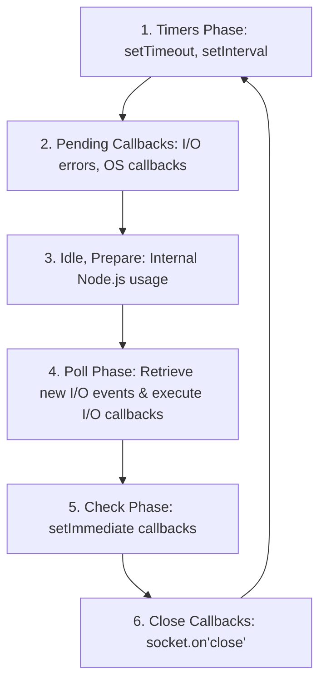

# 🟢 Node.js & Express - Advanced / Hard Questions

> **Topics Covered:** Node.js Event Loop Internals (Phases: Timers, Pending Callbacks, Idle/Prepare, Poll, Check, Close), Streams & Buffers (Handling GBs of Data), Node.js Clustering & Worker Threads (`cluster` module, PM2), `process.nextTick()` vs `setImmediate()`, Memory Leaks & Garbage Collection Profiling in Node.

---

### Q1: Node.js Event Loop Phases & `process.nextTick()` vs `setImmediate()` ⭐⭐⭐
**Question:** Explain the 6 phases of the Libuv Event Loop in Node.js. How does `process.nextTick()` differ from `setImmediate()`?

**Answer:**
The Libuv Event Loop in Node.js processes operations through 6 distinct phases in each iteration (tick):



- **`process.nextTick()`**: Executes **immediately after the current operation completes**, before the event loop advances to *any* next phase. Can starve the Event Loop if called recursively.
- **`setImmediate()`**: Executes in the **Check phase** of the event loop.

---

### Q2: Streams and Buffers: Processing Large Files without Memory Crashes
**Question:** What are Node.js Streams? Create a stream pipeline to read a 5GB file, compress it with Gzip, and write it to disk without exceeding RAM limits.

**Answer:**
- **Streams** allow reading and writing data chunk-by-chunk in pieces rather than loading the entire payload into RAM memory at once.
- 4 Types: `Readable`, `Writable`, `Duplex`, `Transform`.

```javascript
const fs = require('fs');
const zlib = require('zlib');
const { pipeline } = require('stream/promises');

async function compressLargeFile() {
  try {
    await pipeline(
      fs.createReadStream('large_database_dump.sql'), // 5GB Readable Stream
      zlib.createGzip(),                             // Transform Stream
      fs.createWriteStream('database_dump.sql.gz')    // Writable Stream
    );
    console.log('Compression successful with under 50MB RAM usage!');
  } catch (err) {
    console.error('Pipeline failed:', err);
  }
}
compressLargeFile();
```

---

### Q3: Clustering & Worker Threads (Multi-Core CPU Scaling)
**Question:** How does Node.js leverage multi-core CPU architectures? Compare the `cluster` module with `worker_threads`.

**Answer:**
- **`cluster` Module**: Forks multiple separate Node.js processes (master/worker), each with its own V8 instance, Event Loop, and memory space, sharing the same server port (managed via round-robin IPC).
- **`worker_threads`**: Runs multiple JavaScript execution threads sharing memory (`SharedArrayBuffer`) within a single Node.js process. Ideal for CPU-heavy mathematical computations (image processing, cryptography).
