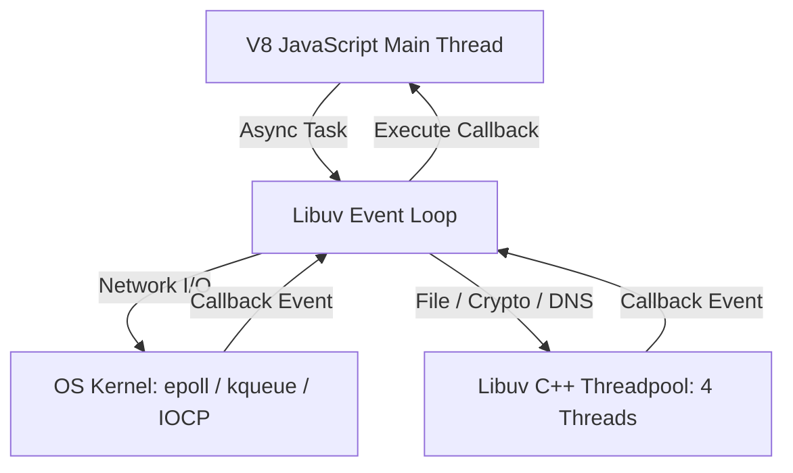

# 🟢 Node.js Core Architecture & Systems

> **Topics Covered:** What is Node.js, Single-Threaded Event Loop & Libuv C++ Threadpool, Is Node Really Single-Threaded?, Worker Threads vs Clustering vs Child Processes (`fork()`), Streams (Readable, Writable, Duplex, Transform), Buffers & Backpressure, `EventEmitter`, `process.nextTick()` vs `setImmediate()`, `package.json` vs `package-lock.json`, npm vs npx, CommonJS vs ESM, Global Error Handling, Memory Leaks & CPU-Intensive Tasks.

---

### Q1: What is Node.js and is it Actually Single-Threaded? ⭐⭐⭐
**Question:** What is Node.js? Why is it said to be single-threaded, and is it *truly* single-threaded under the hood?

**Answer:**
- **Node.js** is an open-source, cross-platform JavaScript runtime environment built on Google Chrome's **V8 JavaScript Engine**.
- **Is it single-threaded?**:
  - **JavaScript Main Thread**: **Yes**. All JavaScript code, event loop orchestration, and callbacks execute on a single thread (V8 Call Stack).
  - **Under the Hood (Libuv & C++ Layer)**: **No, it is multi-threaded**. Heavy background tasks (File System I/O, DNS lookup, Cryptography via `crypto`, Compression via `zlib`) are automatically offloaded to **Libuv's C++ Threadpool** (default 4 worker threads, configurable via `UV_THREADPOOL_SIZE`).
  - Network I/O (HTTP sockets, TCP) uses the OS kernel's native non-blocking asynchronous polling mechanisms (`epoll` on Linux, `kqueue` on macOS, `IOCP` on Windows).



---

### Q2: Explain the 6 Phases of the Libuv Event Loop
**Question:** What are the 6 distinct phases of the Node.js Event Loop?

**Answer:**
In each iteration ("tick") of the event loop, Node processes queues in this strict order:
1. **Timers Phase**: Executes callbacks scheduled by expired `setTimeout()` and `setInterval()`.
2. **Pending Callbacks Phase**: Executes I/O callbacks deferred to the next loop iteration (e.g. system TCP errors).
3. **Idle, Prepare Phase**: Internal Node.js usage only.
4. **Poll Phase**: Retrieves new I/O events, calculates sleep timeout, and executes incoming I/O callbacks (Incoming requests, Database results, File reads).
5. **Check Phase**: Executes callbacks registered with **`setImmediate()`**.
6. **Close Callbacks Phase**: Executes close events (e.g. `socket.on('close')`).

> [!IMPORTANT]
> **Microtask Priority**: `process.nextTick()` queue and Promise Microtask queue execute **between every phase** and immediately after the current operation finishes!

---

### Q3: `process.nextTick()` vs `setImmediate()` vs `setTimeout()`
**Question:** Compare `process.nextTick()`, `setImmediate()`, and `setTimeout()`.

**Answer:**
| Function | Execution Timing | Phase |
| :--- | :--- | :--- |
| **`process.nextTick()`** | Runs immediately after current operation completes, before advancing to next event loop phase | High-priority microtask queue |
| **`Promise.then()`** | Runs right after `nextTick` queue empties, before any macrotask | Standard microtask queue |
| **`setImmediate()`** | Runs on the next iteration of the event loop | **Check Phase** |
| **`setTimeout(fn, 0)`** | Runs after minimum specified timer threshold expires | **Timers Phase** |

```javascript
console.log("1");
setTimeout(() => console.log("2 (setTimeout)"), 0);
setImmediate(() => console.log("3 (setImmediate)"));
process.nextTick(() => console.log("4 (nextTick)"));
Promise.resolve().then(() => console.log("5 (Promise)"));
console.log("6");

// Output:
// 1
// 6
// 4 (nextTick always runs first before microtasks/macrotasks)
// 5 (Promise microtask)
// 2 or 3 (Timers / Check phase depending on startup timing)
```

---

### Q4: Worker Threads vs Cluster Module vs Child Processes
**Question:** Compare Worker Threads, Clustering, and Child Processes in Node.js.

**Answer:**
- **Child Processes (`child_process.fork()`)**: Spawns independent operating system processes with separate memory and V8 instances. Communicates via IPC (Inter-Process Communication).
- **Cluster Module (`cluster`)**: Spawns multiple worker processes across multiple CPU cores sharing a single server port via Master-Worker architecture.
- **Worker Threads (`worker_threads`)**: Runs multiple JavaScript threads **sharing memory (`SharedArrayBuffer`)** within a single Node.js process. Best for CPU-intensive computing (image compression, machine learning inference).

---

### Q5: Streams, Buffers, and Backpressure ⭐⭐⭐
**Question:** What are Buffers and Streams? What is Backpressure and how do you handle it?

**Answer:**
- **Buffer**: A chunk of raw binary memory allocated outside the V8 heap (`Buffer.from()`, `Buffer.alloc()`).
- **Stream**: An abstract interface for reading/writing data piece-by-piece in continuous chunks.
  1. `Readable` (e.g. `fs.createReadStream`, HTTP `req`)
  2. `Writable` (e.g. `fs.createWriteStream`, HTTP `res`)
  3. `Duplex` (e.g. TCP Socket, both read and write)
  4. `Transform` (e.g. `zlib.createGzip()`, alters data chunk-by-chunk)
- **Backpressure**: Occurs when a Readable Stream produces data faster than the Writable Stream can write to disk/network. Handled automatically using `.pipe()` or `pipeline()`.

```javascript
const fs = require('fs');
const zlib = require('zlib');
const { pipeline } = require('stream/promises');

async function processBigFile() {
  await pipeline(
    fs.createReadStream('input_huge.csv'),
    zlib.createGzip(),
    fs.createWriteStream('output.csv.gz')
  );
  console.log("Stream completed with minimal RAM usage!");
}
```

---

### Q6: `EventEmitter` Architecture
**Question:** What is the `EventEmitter` pattern in Node.js?

**Answer:**
Many core Node.js objects (`http.Server`, `fs.ReadStream`) inherit from `EventEmitter`. It implements the Publisher-Subscriber (Pub/Sub) pattern.

```javascript
const EventEmitter = require('events');
class OrderService extends EventEmitter {}

const orderService = new OrderService();
orderService.on('orderPlaced', (order) => {
  console.log(`Sending confirmation email to ${order.customerEmail}`);
});

// Emit event
orderService.emit('orderPlaced', { id: 101, customerEmail: 'user@example.com' });
```

---

### Q7: `package.json` vs `package-lock.json` & `npm` vs `npx`
**Question:** Compare `package.json` and `package-lock.json`. What is the difference between `npm` and `npx`?

**Answer:**
- **`package.json`**: Declares direct dependencies and semantic version ranges (`^1.2.3`, `~1.2.3`).
- **`package-lock.json`**: Locks down the **exact, deterministic dependency tree** including transitive sub-dependencies and integrity SHA hashes.
- **`npm`**: Package manager used to install, update, and manage dependencies (`npm install`).
- **`npx` (Node Package Execute)**: CLI tool to execute npm package binaries directly without installing them globally or permanently (`npx create-react-app my-app`).

---

### Q8: Global Error Handling & Preventing Memory Leaks
**Question:** How do you handle unhandled errors globally in Node.js and prevent memory leaks?

**Answer:**
```javascript
// 1. Uncaught Synchronous Exceptions:
process.on('uncaughtException', (err) => {
  console.error('CRITICAL UNCAUGHT EXCEPTION:', err);
  process.exit(1); // Always exit to prevent corrupted memory state!
});

// 2. Unhandled Promise Rejections:
process.on('unhandledRejection', (reason, promise) => {
  console.error('UNHANDLED REJECTION at:', promise, 'reason:', reason);
});
```

**Preventing Memory Leaks:**
1. Clean up event listeners (`emitter.removeListener()` or `AbortSignal`).
2. Avoid growing global variables/caches indefinitely; use LRU caches with maximum sizes (`lru-cache`).
3. Clear `setInterval` timers on component/request teardown.
