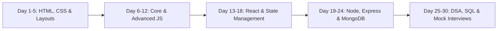

# 🚀 Full Stack Web & Mobile Interview Master Guide

**A complete, interview-tested technical preparation repository designed for Freshers, Junior, and Mid-Level Full Stack Developers.**

[Explore Topics](#-subject-wise-navigation-matrix) • [Quick Revision Checklist](#-quick-interview-revision-checklist-66-key-topics) • [Interview Roadmap](#-30-day-interview-preparation-roadmap)

---

## 📖 Overview

This repository contains **160+ in-depth questions and answers** covering theoretical fundamentals, practical code implementations, output prediction puzzles, and system architecture across frontend, backend, databases, and algorithms.

> [!TIP]
> Each question follows the **Interview-Ready Format**: concise definitions, key trade-offs, interactive code examples, and edge cases to help you speak confidently during technical rounds.

---

## 📚 Subject-Wise Navigation Matrix

| Domain | 🟢 Easy / Fundamentals | 🟡 Medium / Applied | 🔴 Hard / Advanced |
| :--- | :--- | :--- | :--- |
| **🌐 HTML** | [HTML Easy](./HTML/HTML_EASY.md) HTML5, Semantics, Block/Inline, Forms | [HTML Medium](./HTML/HTML_MEDIUM.md) `async`/`defer`, Storage, `rel="noopener"` | [HTML Hard](./HTML/HTML_HARD.md) Canvas vs SVG, CRP, Shadow DOM, CSP |
| **🎨 CSS** | [CSS Easy](./CSS/CSS_EASY.md) Box Model, Margin/Padding, Specificity | [CSS Medium](./CSS/CSS_MEDIUM.md) Flexbox, Grid, Positioning, `z-index` | [CSS Hard](./CSS/CSS_HARD.md) Reflow/Repaint, GPU Transforms, Variables |
| **📜 JavaScript** | [JavaScript Easy](./JavaScript/JAVASCRIPT_EASY.md) Hoisting, TDZ, Scope, Spread/Rest, DOM | [JavaScript Medium](./JavaScript/JAVASCRIPT_MEDIUM.md) Closures, Promises, Debounce/Throttle | [JavaScript Hard](./JavaScript/JAVASCRIPT_HARD.md) Event Loop, Microtasks, Prototypes, Polyfills |
| **⚛️ React** | [React Easy](./React/REACT_EASY.md) Virtual DOM, JSX, Props/State, `useState` | [React Medium](./React/REACT_MEDIUM.md) `useEffect`, Context API, `useReducer`, RTK | [React Hard](./React/REACT_HARD.md) Fiber Architecture, Concurrency, Lazy/Suspense |
| **📱 React Native** | [React Native Easy](./ReactNative/REACT_NATIVE_EASY.md) Core Views, `StyleSheet`, `FlatList` vs `map` | [React Native Medium](./ReactNative/REACT_NATIVE_MEDIUM.md) Navigation, MMKV vs AsyncStorage | [React Native Hard](./ReactNative/REACT_NATIVE_HARD.md) New Architecture: Fabric, JSI, TurboModules |
| **🟢 Node & Express** | [Express Easy](./Node.js/Express/EXPRESS_EASY.md) V8, Libuv, Routing, CJS vs ESM | [Express Medium](./Node.js/Express/EXPRESS_MEDIUM.md) Middleware, JWT, Bcrypt, Error Handling | [Express Hard](./Node.js/Express/EXPRESS_HARD.md) Event Loop Phases, Streams, Clustering |
| **🍃 MongoDB** | [MongoDB Easy](./DATABASE/MongoDB/MONGODB_EASY.md) BSON vs JSON, CRUD Operations | [MongoDB Medium](./DATABASE/MongoDB/MONGODB_MEDIUM.md) 9 Index Types, Aggregation, `populate()` | [MongoDB Hard](./DATABASE/MongoDB/MONGODB_HARD.md) Replica Sets, Oplog, Sharding Architecture |
| **🐬 MySQL** | [MySQL Easy](./DATABASE/MySQL/MYSQL_EASY.md) Relational Schema, Keys | [MySQL Medium](./DATABASE/MySQL/MYSQL_MEDIUM.md) Joins, `WHERE` vs `HAVING`, Window Functions | [MySQL Hard](./DATABASE/MySQL/MYSQL_HARD.md) Query Optimization, Indexing Plans |
| **🗄️ DBMS** | [DBMS Easy](./DBMS/DBMS_EASY.md) ACID Properties, Normalization 1NF-BCNF | [DBMS Medium](./DBMS/DBMS_MEDIUM.md) Transactions, Isolation Levels | [DBMS Hard](./DBMS/DBMS_HARD.md) Deadlocks, Concurrency Control |
| **🧩 DSA & C++** | [DSA Easy](./DSA/DSA_EASY.md) Two Pointers, Stack, Kadane, Math | [DSA Medium](./DSA/DSA_MEDIUM.md) Trees, Linked Lists, Binary Search | [DSA Hard](./DSA/DSA_HARD.md) Graphs, DP, Advanced Trees |
| **⚡ C++** | [C++ Easy](./CPP/CPP_EASY.md) OOP, Pointers, Memory | [C++ Medium](./CPP/CPP_MEDIUM.md) STL Containers, References | [C++ Hard](./CPP/CPP_HARD.md) Templates, Advanced OOP |

---

## 🔥 Top Feature Deep Dives

> [!NOTE]
> Dive deep into high-frequency interview topics with dedicated diagrams, architectural flowcharts, and production-tested patterns:

- 🧠 **JavaScript Closures & Lexical Environments**: [Explore in JAVASCRIPT_MEDIUM.md](./JavaScript/JAVASCRIPT_MEDIUM.md#q1-closures-in-javascript-)
- ⚡ **JavaScript Event Loop (Call Stack, Microtasks vs Macrotasks)**: [Explore in JAVASCRIPT_HARD.md](./JavaScript/JAVASCRIPT_HARD.md#q1-the-javascript-event-loop--concurrency-model-)
- ⏱️ **Debouncing vs Throttling**: [Explore in JAVASCRIPT_MEDIUM.md](./JavaScript/JAVASCRIPT_MEDIUM.md#q4-debouncing-vs-throttling-deep-dive---)
- 🔄 **React Context API Architecture**: [Explore in REACT_MEDIUM.md](./React/REACT_MEDIUM.md#q3-context-api-flow-structure-)
- 🛡️ **`useReducer` vs Redux Toolkit (RTK) vs RTK Query Matrix**: [Explore in REACT_MEDIUM.md](./React/REACT_MEDIUM.md#q5-usereducer-vs-redux-vs-redux-toolkit-rtk-vs-rtk-query-)
- 📱 **React Native New Architecture (Fabric, JSI, TurboModules)**: [Explore in REACT_NATIVE_HARD.md](./ReactNative/REACT_NATIVE_HARD.md#q1-react-native-new-architecture-fabric-turbomodules-jsi-codegen-)
- 🍃 **MongoDB 9 Types of Indexing & Query Profiling**: [Explore in MONGODB_MEDIUM.md](./DATABASE/MongoDB/MONGODB_MEDIUM.md#q1-types-of-indexing-in-mongodb-)
- 🔐 **Authentication Flow: JWT + Bcrypt**: [Explore in EXPRESS_MEDIUM.md](./Node.js/Express/EXPRESS_MEDIUM.md#q2-authentication-with-jwt-json-web-tokens--bcrypt)

---

## ⚡ Quick Interview Revision Checklist (66 Key Topics)

Use this checklist to self-test before your interview rounds:

### 🌐 Frontend (HTML & CSS)
- [ ] HTML vs HTML5
- [ ] Semantic Tags & SEO
- [ ] Block vs Inline vs Inline-Block
- [ ] Types of CSS (Inline, Internal, External)
- [ ] CSS Box Model & `box-sizing: border-box`
- [ ] Flexbox (Axes, Properties, Centering)
- [ ] CSS Grid (1D vs 2D Layouts)
- [ ] CSS Position (`static`, `relative`, `absolute`, `fixed`, `sticky`)

### 📜 Core JavaScript
- [ ] `var` vs `let` vs `const`
- [ ] Hoisting & Temporal Dead Zone (TDZ)
- [ ] Scope (Global, Function, Block) & Scope Chaining
- [ ] Lexical Scope & Closures
- [ ] `ReferenceError` vs `TypeError`
- [ ] Spread vs Rest Operator (`...`)
- [ ] Array & Object Destructuring
- [ ] Shallow Copy vs Deep Copy (`structuredClone`)
- [ ] ES6 Features Overview
- [ ] Currying & Partial Application
- [ ] `map()` vs `filter()` vs `reduce()`
- [ ] Promises, States & Chaining
- [ ] `async`/`await` & Error Handling (`try/catch`)
- [ ] Callback Functions & Callback Hell
- [ ] Debouncing vs Throttling
- [ ] Event Bubbling, Capturing & Delegation
- [ ] DOM APIs (`getElementById`, `createElement`, `innerHTML` vs `textContent`)

### ⚛️ React & React Native
- [ ] React Virtual DOM & Reconciliation
- [ ] Props vs State
- [ ] React Hooks Rules & `useState`
- [ ] `useEffect` Lifecycle & Dependency Array
- [ ] Context API vs Prop Drilling
- [ ] `useReducer` Flow & Pure Reducers
- [ ] `useReducer` vs Redux vs RTK Query
- [ ] Pure Functions & Side Effects
- [ ] React Native `FlatList` vs `map()`
- [ ] React Native `ScrollView` vs `SafeAreaView`

### 🟢 Backend (Node.js & Express)
- [ ] Node.js Runtime, V8 & Libuv
- [ ] Single-Threaded Event Loop & Non-Blocking I/O
- [ ] CommonJS (`require`) vs ES Modules (`import`)
- [ ] Express.js Routing & Request Parameters (`params`, `query`, `body`)
- [ ] Express Middleware & 5 Middleware Types
- [ ] JWT Authentication Flow
- [ ] Password Hashing with `bcrypt`

### 🍃 Database (MongoDB, SQL & DBMS)
- [ ] MongoDB (NoSQL) vs MySQL (SQL)
- [ ] BSON vs JSON
- [ ] MongoDB Indexing (Single, Compound, Multikey, Text)
- [ ] Mongoose `populate()` vs Embedded Documents
- [ ] ACID Properties (Atomicity, Consistency, Isolation, Durability)
- [ ] Database Normalization (1NF, 2NF, 3NF, BCNF)
- [ ] SQL Joins (INNER, LEFT, RIGHT, FULL, SELF)

### 🧩 DSA & Problem Solving
- [ ] Big-O Time & Space Complexity
- [ ] Missing Number in Array ($n(n+1)/2$)
- [ ] Prime Number Check ($O(\sqrt{n})$)
- [ ] Armstrong Number Verification
- [ ] Recursion & Factorial Calculation
- [ ] Fibonacci Sequence Iterative ($O(n)$)
- [ ] Reverse an Array (Two Pointers)
- [ ] Swap Two Variables Without Third Variable

---

## 🎯 30-Day Interview Preparation Roadmap

1. **Week 1 (HTML, CSS, Web Basics)**: Master Semantics, Box Model, Flexbox, Grid, Positioning, Responsive Design.
2. **Week 2 (Deep JavaScript)**: Master Scope, Closures, Event Loop, Promises, Async/Await, Array Methods, Debounce/Throttle.
3. **Week 3 (React & React Native)**: Master Virtual DOM, Hooks (`useEffect`, `useReducer`, `useRef`), Context API, RTK Query, FlatList.
4. **Week 4 (Backend & Databases)**: Master Express Middleware, JWT, Bcrypt, MongoDB Indexing, Aggregations, ACID, SQL Joins.
5. **Final Days (DSA & Mock Practice)**: Two Pointers, Stacks, Linked Lists, Tree Traversals, SQL Queries, and System Flow explanations.

---

**⭐ Star this repository to keep it handy for quick revision before your interviews!**

*Created with ❤️ for aspiring Full Stack Developers.*

