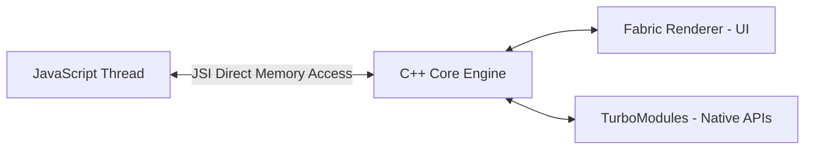

# 📱 React Native - Advanced / Hard Questions

> **Topics Covered:** React Native Architecture: Old Bridge vs New Architecture (Fabric Renderer, TurboModules, JSI, Codegen), Native Modules & Native UI Components, Hermes JS Engine, Memory & Frame Drop Optimization.

---

### Q1: React Native New Architecture (Fabric, TurboModules, JSI, Codegen) ⭐⭐⭐
**Question:** Explain the architectural difference between the Old Bridge Architecture and the New Architecture in React Native.

**Answer:**

#### Old Architecture (Bridge Bottleneck):
```
JS Thread (V8/JSC)  <=== Asynchronous JSON Bridge ===>  Native Thread (UI / Shadow Tree)
```
- **Limitations:**
  - All communication required asynchronous JSON serialization and deserialization over the bridge.
  - Could not perform synchronous UI updates, causing white screen glitches during fast scrolling.

#### New Architecture:


1. **JSI (JavaScript Interface)**: Replaces the JSON bridge. Allows JavaScript code to hold direct references to C++ host objects and invoke native methods synchronously and directly.
2. **Fabric Renderer**: Next-generation rendering engine. Unifies UI layout (Yoga) in C++, enabling concurrent React 18 rendering and synchronous layouts.
3. **TurboModules**: Replaces native modules. Native modules are lazy-loaded only when requested rather than all initializing on app startup.
4. **Codegen**: Generates static type-safe C++ bindings from TypeScript / Flow specs to guarantee type safety between JS and native layers.
