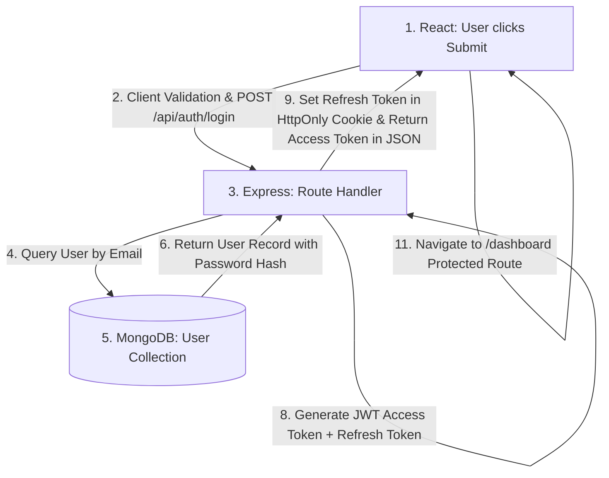

# 🏗️ Full-Stack Scenario & Architecture Questions

> **Real-World Engineering Challenges:** Complete MERN Login Flow, How React Communicates with Express & MongoDB, Private Route Protection, Token Expiry & Silent Refresh, Pagination for 1 Million Users, API Optimization (Database & Caching), Handling 10,000 Concurrent Users, MongoDB Downtime Resilience, Uploading 500MB Files, Duplicate Request Prevention, Real-Time Chat & Notification System Design.

---

### Q1: Explain the Complete MERN Login Flow from React to MongoDB and Back ⭐⭐⭐
**Question:** Walk me through the exact end-to-end data flow when a user fills in a login form and clicks "Submit" in a MERN application.

**Answer:**



1. **React Client**: User inputs email/password in controlled inputs. Form submission triggers `handleSubmit`, runs client-side validation, and fires an Axios/Fetch `POST /api/v1/auth/login` request with `{ email, password }`.
2. **Express Middleware**: Request passes through `helmet()`, `cors()`, and `express.json()`.
3. **Controller & Validation**: Auth controller validates inputs using Zod/Joi schema.
4. **Database Query**: Queries MongoDB via Mongoose: `User.findOne({ email }).select('+password')`.
5. **Password Comparison**: Calls `await bcrypt.compare(password, user.password)`. If invalid, returns `401 Unauthorized`.
6. **Token Issuance**: Generates a 15-minute JWT Access Token and a 7-day Refresh Token.
7. **Response & Cookie**: Sets Refresh Token into an `HttpOnly, Secure, SameSite=Strict` cookie, and returns `{ success: true, token: accessToken, user: { id, name, role } }`.
8. **Client State**: React stores the user and access token in React state (Context API/Zustand), attaches authorization headers to Axios interceptors, and redirects user to protected dashboard.

---

### Q2: How Would You Implement Pagination for 1 Million Users? (Offset vs Keyset)
**Question:** Why does traditional `.skip().limit()` fail at 1 million records? What is Keyset (Cursor) pagination?

**Answer:**
- **The Problem with Offset Pagination (`skip(500000).limit(20)`)**:
  MongoDB must scan through 500,000 index entries and discard them before returning 20 records. Query execution time degrades from 2ms to 2000ms+ ($O(N)$).
- **Keyset / Cursor-Based Pagination ($O(1)$)**:
  Instead of skipping, query documents greater than the last seen `_id` or timestamp using an indexed field.

```javascript
// Keyset Pagination Query (Instant 1ms regardless of page depth):
const query = lastId ? { _id: { $gt: new mongoose.Types.ObjectId(lastId) } } : {};
const users = await User.find(query)
  .sort({ _id: 1 })
  .limit(20);
```

---

### Q3: How Would You Handle 10,000 Concurrent Users on a Node.js Backend?
**Question:** What architectural steps do you take to scale a Node.js system to handle 10k+ concurrent requests?

**Answer:**
1. **Clustering & Process Management**: Run Node in cluster mode across all available CPU cores using **PM2** (`pm2 start server.js -i max`).
2. **Reverse Proxy Load Balancing**: Place **Nginx** or AWS Application Load Balancer (ALB) in front to distribute traffic across multiple Node server instances.
3. **In-Memory Caching (Redis)**: Cache high-traffic read queries in **Redis** with TTL to prevent hammering the database.
4. **Connection Pooling**: Configure MongoDB / PostgreSQL connection pool sizes appropriately to avoid connection exhaust.
5. **Asynchronous Task Offloading**: Move heavy asynchronous tasks (email sending, image processing, PDF generation) to background worker queues using **BullMQ / RabbitMQ / Kafka**.
6. **CDN for Static Assets**: Offload all static media to AWS S3 + CloudFront.

---

### Q4: How Would You Upload a 500MB File in a MERN Application?
**Question:** How do you handle 500MB+ file uploads without exhausting Node.js RAM memory or timing out?

**Answer:**
- **Anti-Pattern**: Uploading 500MB through Express memory buffer will crash the Node process and block the Event Loop.
- **Production Architecture: Direct-to-S3 Presigned URLs**:
  1. Client sends file metadata (filename, size, mimetype) to Express `POST /api/upload/presigned-url`.
  2. Express backend generates an **AWS S3 Presigned URL** using AWS SDK (`S3Client.getSignedUrl`) and returns it to client.
  3. React client uploads the 500MB file **directly to AWS S3** via `PUT` with progress tracking (`onUploadProgress`), completely bypassing the Node server!
  4. S3 triggers an AWS Lambda or webhook to notify backend when upload completes.
