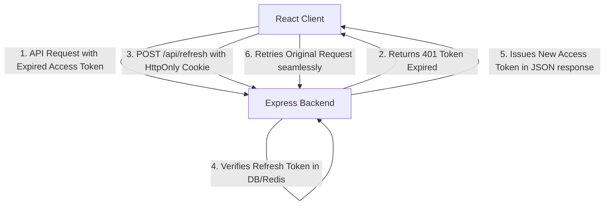

# 🔐 Authentication & Web Security Master Guide

> **Topics Covered:** Authentication vs Authorization, Session-Based Auth vs JWT, JWT Structure & Storage (Why `HttpOnly` Cookies beat `localStorage`), Access Tokens vs Refresh Tokens, Password Hashing with Bcrypt & Salting, OAuth 2.0 Flow vs JWT, XSS (Cross-Site Scripting) & Prevention, CSRF (Cross-Site Request Forgery) & `SameSite` Cookies, SQL Injection & NoSQL Injection Prevention, Rate Limiting & Secrets Management.

---

### Q1: Authentication vs Authorization & Session vs JWT ⭐⭐⭐
**Question:** What is the difference between Authentication and Authorization? Compare Stateful Sessions and Stateless JWTs.

**Answer:**
- **Authentication (AuthN)**: Verifying **who you are** (e.g. Login with email & password, FaceID).
- **Authorization (AuthZ)**: Verifying **what you have permission to do** (e.g. Admin role, edit permissions).

| Feature | Session-Based (Stateful) | JWT-Based (Stateless) |
| :--- | :--- | :--- |
| **Storage Location** | Session ID in Cookie; User state stored in Server RAM / Redis | Entire encrypted payload stored in Client token |
| **Server Scalability** | Requires central session store (Redis) across multiple microservices | Stateless; any service with the secret key can verify |
| **Revocation** | Instant (delete session in Redis) | Harder to revoke before token expiration (requires token blocklist) |
| **Payload Size** | Tiny (Session ID ~32 bytes) | Larger (Contains encoded user data & claims ~500 bytes) |

---

### Q2: JWT Architecture: Access Tokens vs Refresh Tokens & Storage Security
**Question:** Where should JWTs be stored in the browser? Explain the Access Token + Refresh Token rotation flow.

**Answer:**
- **Why `localStorage` is UNSAFE for JWTs**: Any JavaScript running on your page (including third-party analytics, npm dependencies, or an XSS vulnerability) can execute `localStorage.getItem('token')` and steal the token.
- **The Secure Storage Pattern**:
  1. **Access Token (Short-lived, e.g. 15 mins)**: Stored in **Application Memory (React state / variable)**. Automatically erased on page refresh.
  2. **Refresh Token (Long-lived, e.g. 7 days)**: Stored in an **`HttpOnly, Secure, SameSite=Strict` Cookie**. JavaScript cannot read `HttpOnly` cookies, completely blocking XSS theft!

#### Refresh Token Flow:

---

### Q3: Password Hashing with Bcrypt: Hashing vs Encryption vs Salting
**Question:** What is the difference between Hashing and Encryption? Why is Bcrypt used with a Salt?

**Answer:**
- **Encryption (Two-Way)**: Plaintext $
ightarrow$ Ciphertext $
ightarrow$ Decrypted with Key back to Plaintext (Used for sensitive data that must be read later).
- **Hashing (One-Way)**: Plaintext $
ightarrow$ Fixed-length mathematical fingerprint. Cannot be reversed.
- **Why Salting is Mandatory**:
  - Without a salt, identical passwords (e.g. `password123`) produce identical hashes, making them vulnerable to precomputed **Rainbow Table attacks**.
  - **Salt**: A cryptographically random string generated per user and appended to the password before hashing.
  - **Bcrypt Work Factor (Cost factor)**: Uses key stretching to make hash generation intentionally slow (e.g. 10 rounds = ~100ms), making brute-force cracking mathematically infeasible.

---

### Q4: Cross-Site Scripting (XSS) vs Cross-Site Request Forgery (CSRF)
**Question:** Differentiate between XSS and CSRF attacks and explain their exact remediations.

**Answer:**

#### 1. XSS (Cross-Site Scripting):
- **Attack**: Attacker injects malicious `<script>` tags into a vulnerable webpage that executes inside another user's browser.
- **Remediation**:
  - React auto-escapes JSX strings by default.
  - Never use `dangerouslySetInnerHTML` with unsanitized HTML (use DOMPurify).
  - Store tokens in `HttpOnly` cookies.
  - Configure a strict Content Security Policy (`CSP`).

#### 2. CSRF (Cross-Site Request Forgery):
- **Attack**: An attacker tricks an authenticated user into executing an unwanted action on a trusted website (e.g. visiting `evil.com` which secretly sends an automated form post to `bank.com/transfer`).
- **Remediation**:
  - Set **`SameSite=Strict` or `SameSite=Lax`** on authentication cookies (Browser will refuse to attach cookie on cross-site requests).
  - Use **Anti-CSRF Tokens** (Synchronizer Token Pattern).
  - Require re-authentication for sensitive actions.
