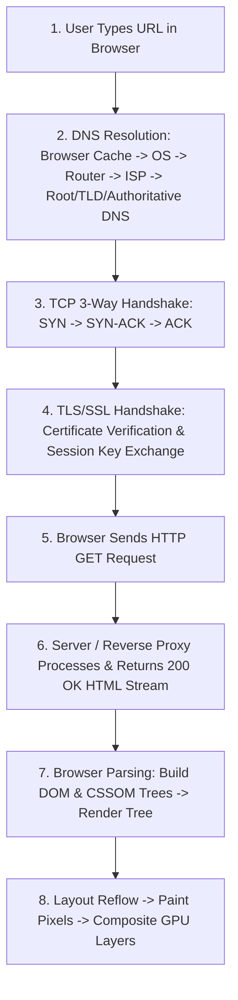

# 🌐 Web Architecture, HTTP & Networking

> **Topics Covered:** What Happens When You Type google.com into the Browser?, HTTP vs HTTPS (TLS/SSL Handshake), HTTP vs TCP/IP Model, DNS Resolution Flow, IP Addresses & Ports, HTTP Request/Response Headers vs Body, REST vs SOAP vs GraphQL, WebSockets vs HTTP vs Server-Sent Events (SSE), CORS & Preflight OPTIONS, HTTP Caching (`Cache-Control`, `ETag`), CDNs & Reverse Proxies (Nginx).

---

### Q1: What Happens When You Type `google.com` into the Browser? ⭐⭐⭐
**Question:** Explain the complete step-by-step lifecycle from pressing Enter on `google.com` to the webpage rendering on screen.

**Answer:**

1. **URL Parsing & HSTS Check**: Browser checks if URL uses HTTPS or has HSTS preload.
2. **DNS Resolution**: Checks Browser DNS cache $
ightarrow$ OS hosts file $
ightarrow$ Local DNS Resolver (ISP) $
ightarrow$ Root DNS (`.`) $
ightarrow$ TLD DNS (`.com`) $
ightarrow$ Google Authoritative Nameserver. Returns IP (e.g., `142.250.190.46`).
3. **TCP 3-Way Handshake**: Client sends `SYN` $
ightarrow$ Server replies `SYN-ACK` $
ightarrow$ Client sends `ACK`.
4. **TLS 1.3 Handshake (HTTPS)**: Client and server exchange cipher suites, verify SSL certificate, and generate symmetric session keys.
5. **HTTP Request & Server Handling**: Client sends `GET / HTTP/1.1`. Load balancer / Nginx routes request to application backend.
6. **Critical Rendering Path (Browser)**:
   - Parses HTML byte stream into **DOM Tree**.
   - Parses CSS into **CSSOM Tree**.
   - Combines into **Render Tree** (omits `display: none`).
   - Runs **Layout (Reflow)** to calculate exact screen coordinates.
   - **Paints** layers and GPU **Composites** pixels to the monitor.

---

### Q2: HTTP vs HTTPS & The TLS/SSL Handshake
**Question:** How does HTTPS secure data over HTTP? Explain the TLS Handshake.

**Answer:**
- **HTTP**: Transmits plaintext over TCP port 80. Vulnerable to Man-in-the-Middle (MitM) packet sniffing.
- **HTTPS**: Encrypts HTTP traffic using **TLS (Transport Layer Security)** over TCP port 443.
- **Hybrid Encryption Model:**
  1. **Asymmetric Encryption** (RSA / ECC public/private keys) is used *only during the initial handshake* to authenticate the server's certificate and securely exchange a shared secret.
  2. **Symmetric Encryption** (AES-GCM session key) is used for all subsequent data transfer because it is computationally thousands of times faster.

---

### Q3: WebSockets vs Server-Sent Events (SSE) vs HTTP Long Polling
**Question:** Compare WebSockets, Server-Sent Events (SSE), and HTTP Long Polling.

**Answer:**
| Feature | HTTP Long Polling | Server-Sent Events (SSE) | WebSockets (`ws://`) |
| :--- | :--- | :--- | :--- |
| **Protocol** | Standard HTTP/1.1 | Standard HTTP/2 or HTTP/1.1 | Custom WebSocket Protocol (TCP) |
| **Direction** | Unidirectional (Client request required) | **Unidirectional (Server $
ightarrow$ Client stream)** | **Full-Duplex (Bidirectional)** |
| **Connection** | Opens and closes new HTTP requests | Single persistent HTTP connection | Single persistent TCP socket |
| **Reconnection** | Manual logic in JS | Built-in automatic reconnection | Handled via library (Socket.io) or manual |
| **Best For** | Legacy fallback | Stock tickers, live sports scores, ChatGPT streaming answers | Real-time chat apps, multiplayer online games, collaborative whiteboard tools |

---

### Q4: CORS & Preflight `OPTIONS` Request Deep Dive
**Question:** What is CORS (Cross-Origin Resource Sharing)? What triggers a Preflight request?

**Answer:**
- **Same-Origin Policy (SOP)**: A browser security rule that blocks JavaScript on Origin A (`https://app.com`) from reading responses from Origin B (`https://api.com`) unless Origin B explicitly grants permission.
- **An Origin is defined by:** `Protocol + Domain + Port`.
- **Preflight Request (`OPTIONS`)**:
  Before sending a "non-simple" request (e.g. methods like `PUT`/`DELETE` or custom headers like `Authorization: Bearer <token>` or `Content-Type: application/json`), the browser automatically dispatches an HTTP `OPTIONS` request.
  - Server must respond with `Access-Control-Allow-Origin`, `Access-Control-Allow-Methods`, and `Access-Control-Allow-Headers`.

---

### Q5: Reverse Proxy vs Forward Proxy & CDNs
**Question:** What is a Reverse Proxy (e.g. Nginx)? How does a CDN work?

**Answer:**
- **Forward Proxy**: Sits in front of a **client**; hides client identity (e.g. Corporate VPNs, Tor).
- **Reverse Proxy**: Sits in front of **backend web servers**; intercepts client traffic.
  - *Benefits:* SSL Termination, Load Balancing (Round-Robin/Least Connections), Gzip compression, Web Application Firewall (WAF), static asset caching.
- **CDN (Content Delivery Network)**: A globally distributed network of edge cache servers (Cloudflare, AWS CloudFront) that cache static assets (images, CSS, JS bundles) geographically close to end users, reducing latency and origin server load.
